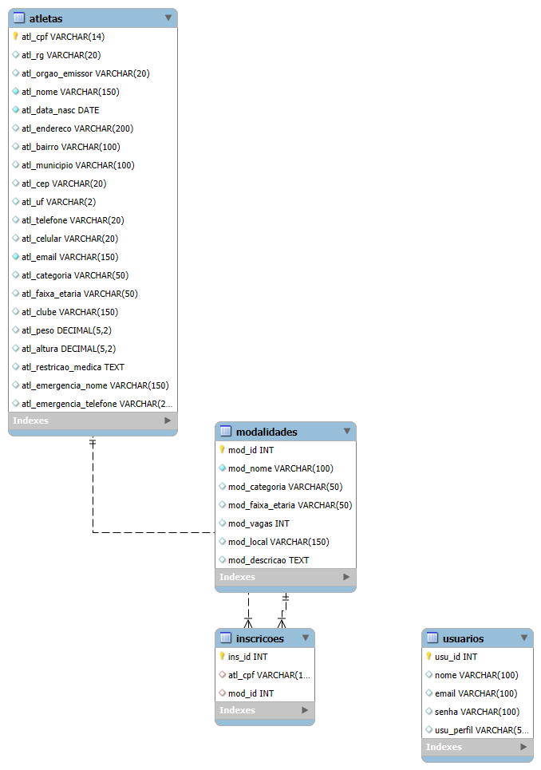

# Projeto Competições Esportivas

Este projeto é composto por um sistema completo com Frontend e Backend para gerenciamento de competições esportivas.

## 🏗️ Estrutura do Projeto
* `/frontend`: Interface do usuário.
* `/backend`: API, regras de negócio e banco de dados.

## 📊 Modelagem do Banco de Dados (MySQL)
Abaixo está o diagrama do banco de dados gerado no MySQL Workbench:

## 🚀 Como rodar o projeto
1. Clone o repositório.
2. Importe o arquivo `banco.sql` no seu MySQL.
3. Instale as dependências no front e no back...